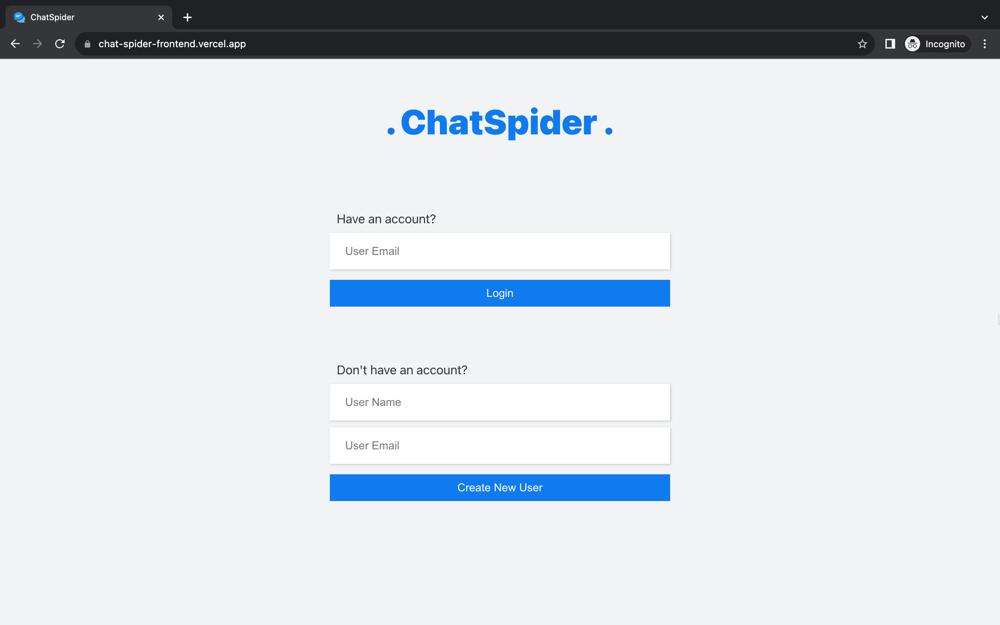
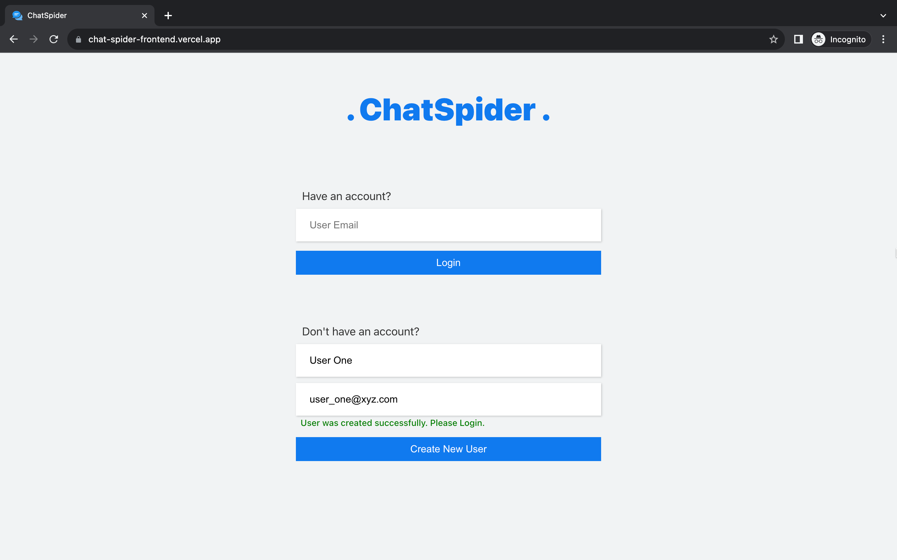
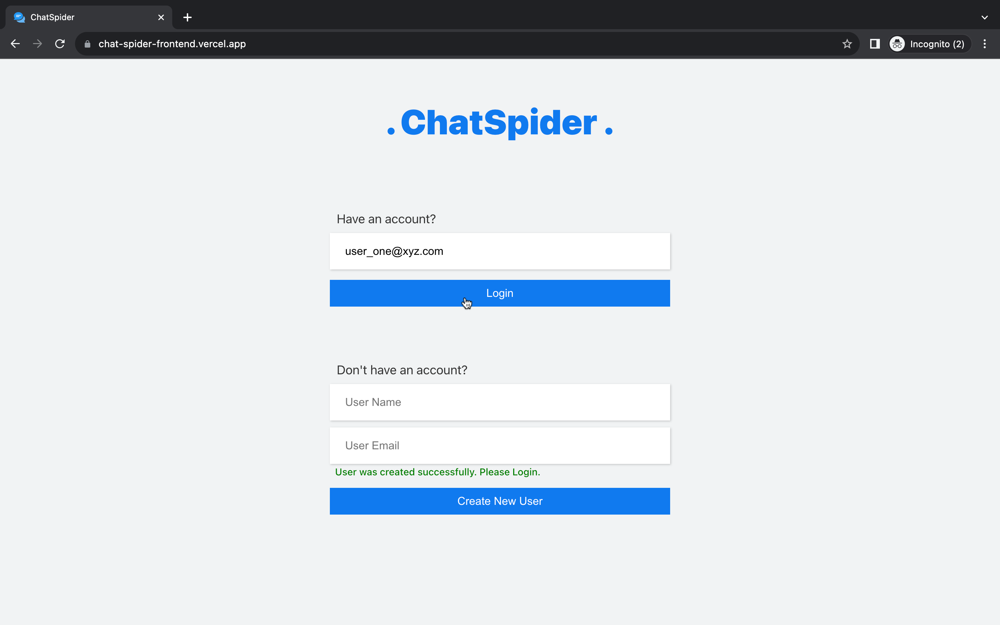
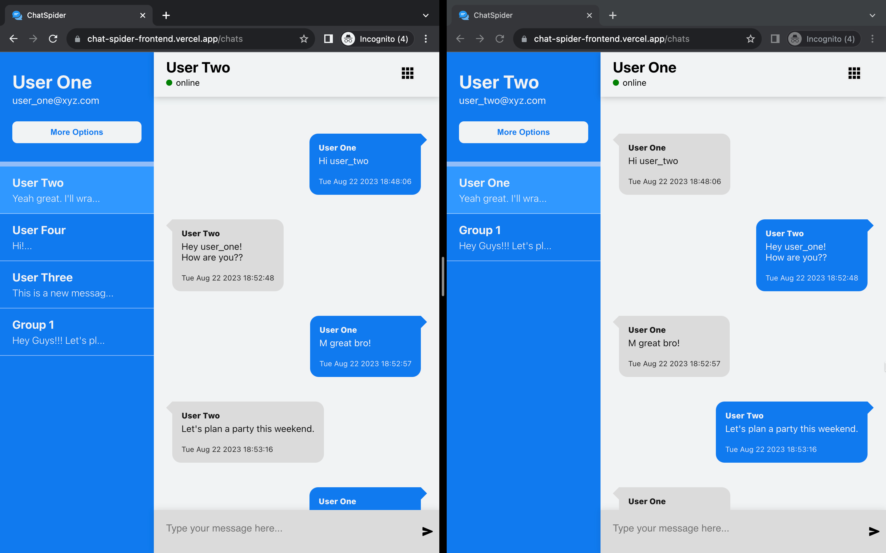
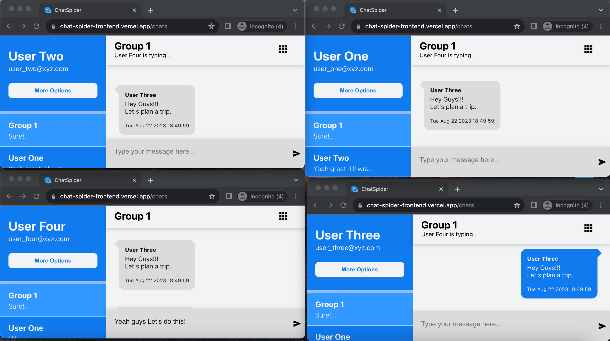
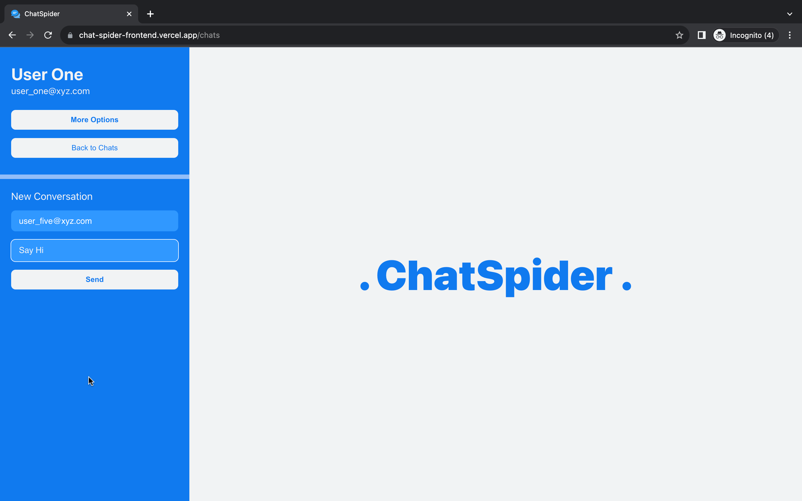
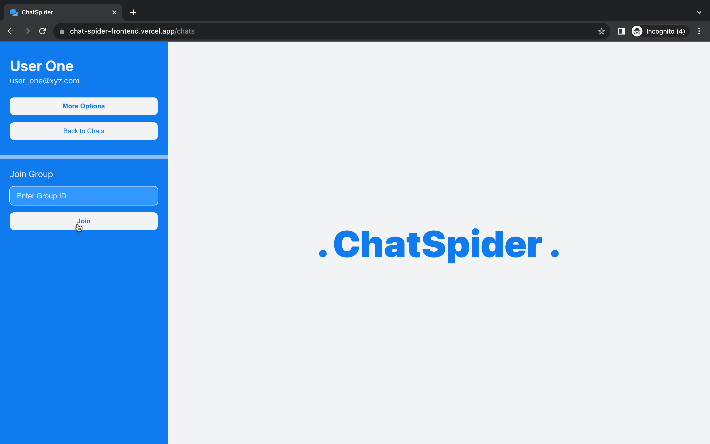
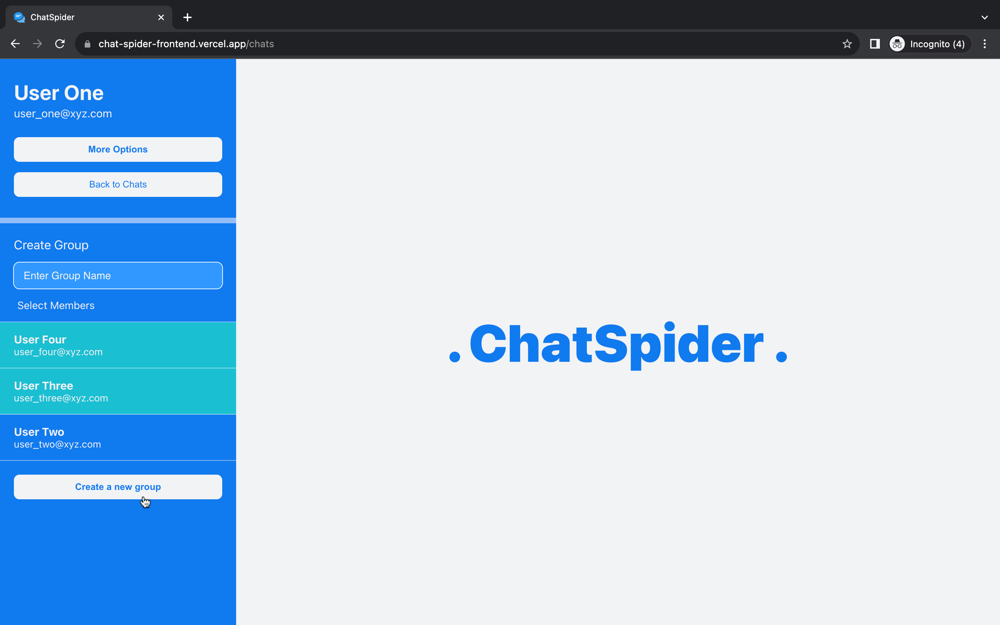
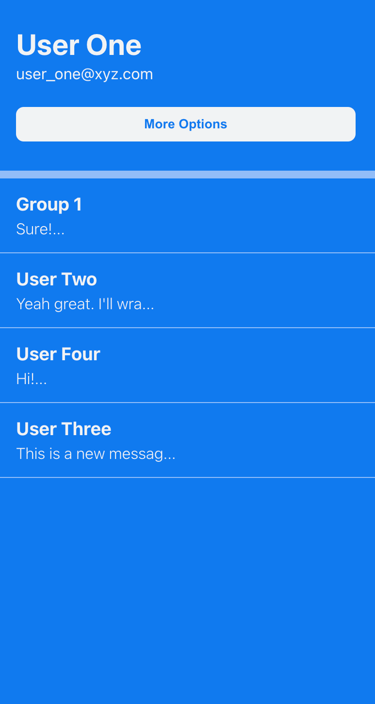

# ChatSpider

A fully responsive **chat application** which provides users with features like **private chat** and **group chat**. The app also shows the **online/offline/typing status** of the recipient on a real-time basis.

In chats, **messages load progressively**. Initial load: first 20 messages. Scrolling up to the top loads 20 more messages each time, **enhancing network performance** by avoiding bulk loading of past messages.

## Tech Stack

This is a Full Stack Web Application.

**Client:** React.js, CSS3

**Server:** Node.js, Express.js

**Database:** MongoDB Atlas

**Miscellaneous:** Socket.io

## Deployment

Frontend is deployed at [Vercel](https://vercel.com/ "Vercel").

Backend is deployed at [Render](https://render.com/ "Render").

## Live

🎉😋 Check it out 👉 [ChatSpider](https://chat-spider-frontend.vercel.app/ "ChatSpider")

## Screenshots

- Home Page: User Login/Singup
  

- Creating New User:
  

- Logging In:
  

- Private Chat:
  

- Group Chat:
  

- Start a new Private Chat:
  

- Join a Group:
  

- Creating a New Group:
  

- Chat Selection in Mobile View:
  
